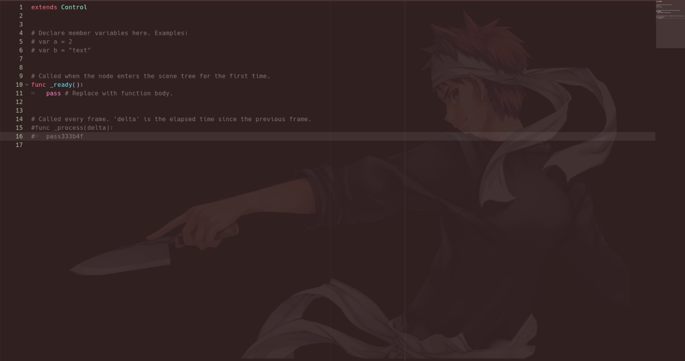
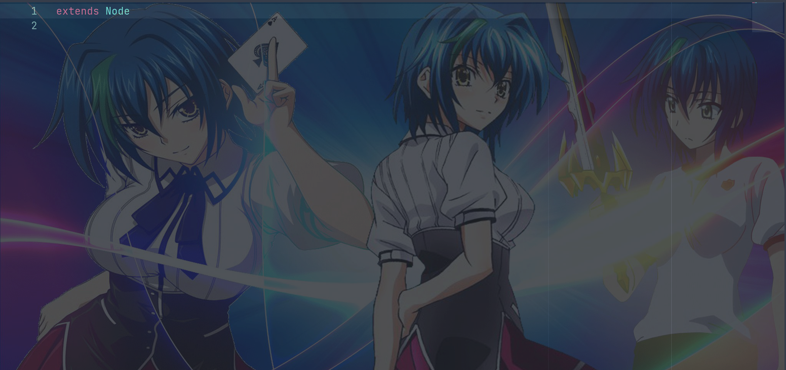
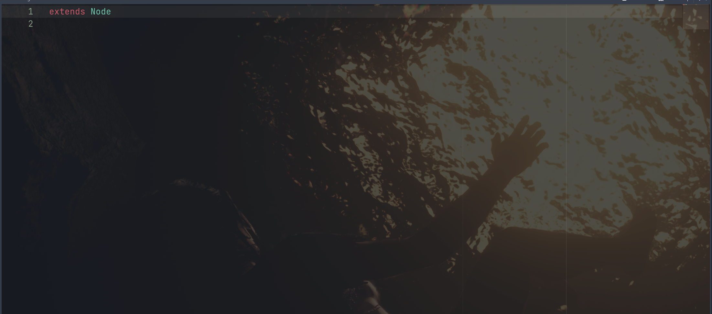
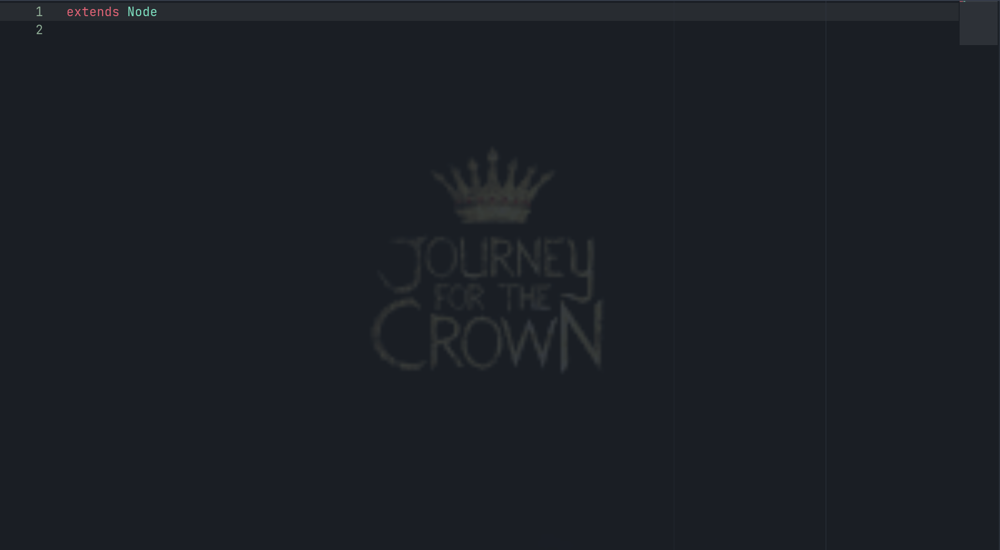

# Code Editor Image Plugin
 Plugin for the Godot game engine that allows you to have an image background for your code editor.

## To Change the Image
To change the image shown on your background, simply open up the addons folder and replace the Background.png file with another png of your choosing. Be sure to name it Background.png to be
recognized. Opacity will be handled by the code so no need to change this in your image. 

## Examples

