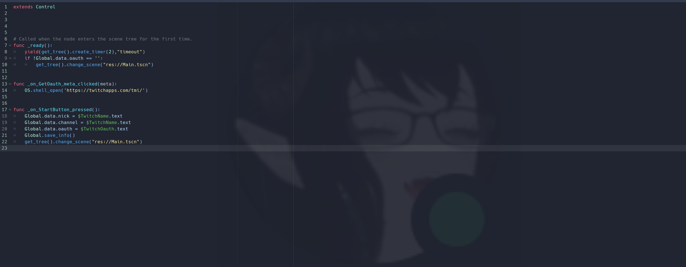

# Code Editor Image Plugin
 Plugin for the Godot game engine that allows you to have an image background for your code editor.

## To Change the Image
To change the image shown on your background, simply use one of the following methods:
 
1. Head up to Project > Tools > Change Background
2. Use the docked background options and press teh change background button
3. Paste in a directory on your computer with images and hit the random button
  
Make sure to hit the save button to save your settings between sessions

## Examples

